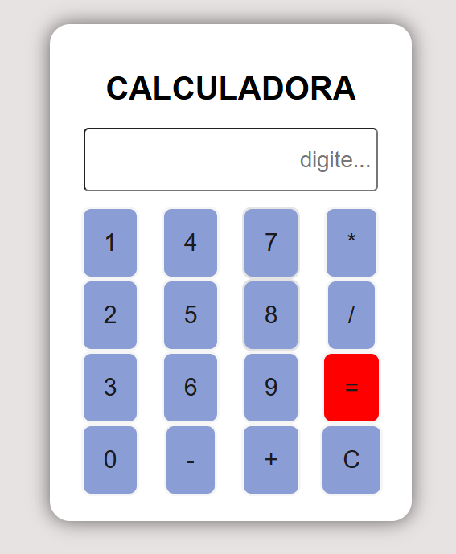

# 💻 Calculadora Simples
Projeto desenvolvido com **HTML**, **CSS** e **JavaScript** para praticar operações básicas.




## 🧮 Acesse a Calculadora
👉 [Use agora](https://gmeirelis.github.io/CALCULADORA/)

## 💻 Funcionalidades
- Realiza operações básicas: soma, subtração, multiplicação e divisão.
- Interface simples e intuitiva.
- Totalmente responsiva.

  ## 🧱 Tecnologias utilizadas
- HTML
- CSS
- JavaScript

  ## 📂 Como executar localmente
1. Baixe ou clone este repositório:
   ```bash
   git clone https://github.com/gmeirelis/CALCULADORA.git
